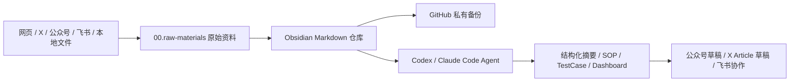

# AI 时代 Obsidian 工作台搭建 SOP

## 1. 目标

搭建一个以 **Obsidian** 为本地知识根基的 AI 工作台，让资料可以在以下渠道之间有序流动：

- 本地 Markdown 笔记
- GitHub 备份
- 浏览器网页剪藏
- 飞书文档 / 多维表格
- 公众号草稿
- X Article 草稿
- Codex / Claude Code 等 AI Agent

最终目标不是“装很多插件”，而是形成一套可长期维护、可追溯、可被 Agent 读取和加工的个人 / 团队知识系统。

## 2. 适用范围

适用于：

- 个人知识库搭建
- 内容创作工作台
- AI Agent 协作资料库
- 自动派工 / 半导体知识资料库
- 原始资料归档与二次提炼

不适用于：

- 临时文件堆放
- 直接存放密钥、Token、Cookie、AppSecret
- 未经授权全文转载第三方内容

## 3. 总体架构



## 4. 前置准备

### 4.1 软件准备

| 工具 | 用途 | 是否必需 |
|---|---|---|
| Obsidian | 本地 Markdown 知识库 | 必需 |
| Git | 本地版本管理 | 推荐 |
| GitHub | 云端备份与历史版本 | 推荐 |
| Chrome | 网页剪藏、X / 公众号 / 插件使用 | 推荐 |
| Codex / Claude Code | AI Agent 协作处理资料 | 推荐 |
| 飞书 CLI | 飞书资料读写与协作 | 可选 |

### 4.2 安全准备

以下信息不得写入笔记正文，也不得提交到 GitHub：

- GitHub Token
- X Cookie / Token
- 飞书 App Secret / Token
- 公众号 AppID / AppSecret
- OpenAI / Claude / 其他模型 API Key
- 任何账号密码、验证码、私钥

建议统一放在本地 `.env`，并确保 `.env` 被 `.gitignore` 排除。

## 5. 创建 Obsidian 本地仓库

### 5.1 下载与安装

1. 打开 Obsidian 官网：<https://obsidian.md/download>
2. 根据系统选择安装包：
   - Windows：下载安装 `.exe`
   - Mac：下载安装 `.dmg`
3. 安装完成后打开 Obsidian。

### 5.2 创建 Vault

1. 选择“创建新仓库”。
2. 仓库名建议清晰，例如：
   - `AI知识库`
   - `内容工作台`
   - `OBSidianCodex`
3. 仓库路径要放在长期稳定位置，例如：
   - `D:\Obsidian\work\OBSidianCodex`
   - `D:\AI知识库`
   - `Documents\Obsidian`

不要放在：

- 下载目录
- 临时桌面文件夹
- 随手创建的测试目录

## 6. 文件夹结构原则

### 6.1 不要一开始过度设计

先写内容，再根据真实业务演化文件夹结构。

推荐原则：

- 能被自己找回
- 能被 Agent 理解
- 原始资料和加工结果分离
- 有 Evidence 可追溯
- 文件夹数量不要过多

### 6.2 推荐最小结构

```text
00.raw-materials/
  10.sources/
  20.metadata/
  90.processed/

30.areas/
  agent-knowledge-ops/
  ai-agent-intel/
  semiconductor-dispatch-intel/
```

## 7. 连接 GitHub 做备份

### 7.1 创建 GitHub 私有仓库

1. 打开：<https://github.com/new>
2. Repository name 填写仓库名，例如：
   - `obsidian-vault-backup`
3. Visibility 选择 **Private**。
4. 不勾选 README、`.gitignore`、License。
5. 点击 Create repository。

### 7.2 本地仓库连接 GitHub

把以下信息交给 Codex 或自己在终端配置：

```text
本地 Obsidian 仓库路径：<你的 vault 路径>
GitHub 仓库地址：<你的 GitHub 仓库 URL>
```

完成后检查：

```text
git status
git remote -v
```

## 8. 配置 Obsidian Git 插件

### 8.1 安装插件

1. 打开 Obsidian 设置。
2. 进入“第三方插件”。
3. 搜索 `Git`。
4. 认准作者 `Vinzent`。
5. 安装并启用。

### 8.2 推荐设置

| 设置项 | 建议值 | 说明 |
|---|---|---|
| Split timers for automatic commit and sync | 关闭 | 小白用一套同步时间即可 |
| Auto commit-and-sync interval | 10 | 每 10 分钟自动备份 |
| Auto commit-and-sync after stopping file edits | 开启 | 停止编辑后再同步 |
| Auto pull interval | 0 | 不按固定时间自动拉取 |
| Auto commit-and-sync only staged files | 关闭 | 自动处理全部改动 |
| Commit message | `vault backup: {{date}}` | 统一提交信息 |
| Date format | `YYYY-MM-DD HH:mm:ss` | 提交时间清晰 |
| Merge strategy | Merge | 尽量合并两边改动 |
| Merge strategy on conflicts | None | 冲突时不要自动乱合 |
| Pull on startup | 开启 | 打开 Obsidian 时先拉取 |
| Push on commit-and-sync | 开启 | 自动同步到 GitHub |
| Pull on commit-and-sync | 开启 | 上传前先拉取 |
| Signs | 关闭 | 写作界面更干净 |
| Hunk commands | 关闭 | 非 Git 高级用户不用 |
| Show status bar | 开启 | 底部显示同步状态 |
| Show branch status bar | 开启 | 显示当前分支 |
| Custom Git binary path | `git` | 使用系统 Git |
| Custom Git directory path | `.git` | 默认即可 |

### 8.3 成功标志

- Obsidian 底部能看到分支名，例如 `main`
- GitHub 仓库能看到新提交
- 换电脑时能从 GitHub 恢复 vault

## 9. 图片与附件管理

### 9.1 推荐插件

使用 **Custom Attachment Location** 管理图片。

### 9.2 推荐配置

| 设置项 | 建议值 |
|---|---|
| 新附件位置 | `./assets/${noteFileName}` |
| 生成附件文件名 | `file-${date:{momentJsFormat:'YYYYMMDDHHmmssSSS'}}` |
| 引用路径 | `assets/${noteFileName}/${generatedAttachmentFileName}` |
| 改名时同步处理 | 开启 |

### 9.3 目标效果

```text
文章.md
assets/文章/file-20260707103000123.png
assets/文章/file-20260707103000456.png
```

这样文章移动、复制、发布时，图片路径更不容易断。

## 10. Markdown 最小写作规范

先掌握以下几类即可：

```markdown
# 一级标题
## 二级标题
### 三级标题

- 无序列表
- 无序列表

1. 有顺序的步骤
2. 有顺序的步骤

> 这里放引用或提醒

[链接文字](https://example.com)

![[本地图片.png]]
```

原则：

- 标题负责结构
- 列表负责步骤
- 表格负责对比
- 引用负责提醒
- 不追求复杂排版

## 11. 常用插件配置

### 11.1 Advanced Tables

用途：管理 Markdown 表格。

建议：

- 显示工具按钮：开启
- 回车自动处理表格：开启
- Tab 在表格中移动：开启
- 表格格式：normal

适用场景：

- 选题清单
- 发布记录
- 素材对照
- 需求字段表
- TestCase 表

### 11.2 Excalidraw

用途：画流程图、脚本结构图、业务关系图。

适合：

- 教程结构
- 派工流程
- Agent 工作流
- 自动化架构图

### 11.3 Terminal

用途：在 Obsidian 中打开命令行，配合 Codex / Claude Code 工作。

注意：

- Obsidian 内部终端和外部终端的 AI 工具记忆可能不互通。
- 不要在终端输出或保存敏感密钥。

## 12. 浏览器网页剪藏

### 12.1 安装 Obsidian Web Clipper

1. 打开 Chrome 应用商店。
2. 搜索并安装 **Obsidian Web Clipper**。
3. 固定到浏览器工具栏。

### 12.2 使用流程

1. 打开 Obsidian，并确认当前 vault 正确。
2. 在浏览器打开要保存的网页。
3. 点击 Obsidian Web Clipper。
4. 选择剪藏模板。
5. 检查保存位置。
6. 保存到 Obsidian。
7. 回到 Obsidian 检查是否生成新笔记。

## 13. 飞书与 Obsidian 数据流

### 13.1 定位

- 飞书：适合团队协作、外部共享、多人编辑。
- Obsidian：适合长期归档、个人沉淀、Agent 再加工。

### 13.2 常用任务

#### 飞书文档进入 Obsidian

```text
请读取这篇飞书文档：<飞书链接>
整理成 Obsidian 笔记。
保存到：00.raw-materials/10.sources/feishu/<文档标题>.md
要求：保留原飞书链接；不要编造来源里没有的内容。
```

#### Obsidian 文章发到飞书

```text
请把这篇 Obsidian 文章发到飞书，创建新文档。
用途：给团队协作修改。
要求：保留标题层级、列表、图片说明和原文顺序。
完成后返回飞书文档链接。
```

#### 新建飞书多维表格

```text
请在飞书中新建一个多维表格，用来管理选题。
字段包括：选题、来源、状态、平台、负责人、截止时间、备注。
建好后返回表格链接。
```

## 14. 公众号草稿工作流

### 14.1 目标

在 Obsidian 中完成文章母稿，再预览公众号排版，最后上传为公众号草稿。

### 14.2 推荐流程

1. 在 Obsidian 写完母稿。
2. 打开公众号预览插件。
3. 检查标题、摘要、封面、正文和图片。
4. 复制到公众号或上传草稿。
5. 到公众号后台人工复核。
6. 最终发布必须人工确认。

### 14.3 安全要求

- 公众号 AppID / AppSecret 不写入文章。
- 不上传到 GitHub。
- IP 白名单错误时，人工到公众号后台处理。

## 15. X Article 草稿工作流

### 15.1 目标

把 Obsidian 文章转换为适合 X Article 的短段落、强标题、少层级版本。

### 15.2 推荐流程

1. 在 Obsidian 写完母稿。
2. 复制一份，命名为：`标题-X文章版.md`。
3. 删除公众号专用话术。
4. 缩短段落。
5. 减少复杂表格。
6. 打开 X Article 预览。
7. 检查标题、首图、段落和图片。
8. 上传到 X 草稿。
9. 打开 X 草稿人工检查。

### 15.3 注意事项

- 公众号文章和 X Article 不要完全共用一版。
- X Cookie、Token、登录态不得写入笔记。

## 16. Agent 协作规范

### 16.1 适合交给 Agent 的任务

- 网页资料剪藏后结构化
- 图片 OCR 后整理
- 飞书资料转 Obsidian
- Obsidian 笔记转 SOP
- 需求单转 TestCase
- 周报 / 简报生成
- Dashboard 更新

### 16.2 不应交给 Agent 自动完成的任务

- 最终群发公众号
- 最终发布 X Article
- 修改账号权限
- 保存或提交密钥
- 处理未授权全文转载
- 未确认范围的大批量删除

## 17. 常见故障排查

| 现象 | 先检查 | 处理方式 |
|---|---|---|
| 插件装不上 | 安全模式、网络、插件市场 | 恢复网络后再安装 |
| GitHub 推送失败 | `git status`、远程地址、权限 | 先排查远程仓库和账号权限 |
| 图片显示不出来 | 图片路径、assets 文件夹 | 用附件插件重新整理 |
| 飞书导出失败 | CLI 登录、文档权限、应用权限 | 先做健康检查 |
| 公众号草稿上传失败 | AppID、AppSecret、IP 白名单 | 不暴露密钥，人工检查白名单 |
| X 草稿上传失败 | 登录态、cookie、浏览器权限 | 重新登录后再试 |
| Terminal 打不开 | 插件是否启用、默认 shell | 重启 Obsidian 或检查插件配置 |
| Git 冲突 | 两台设备是否同时修改 | 不自动合并，交给人工或 Codex 处理 |

## 18. 最小可用系统验收清单

- [ ] Obsidian vault 已创建在长期稳定路径
- [ ] GitHub 私有仓库已创建
- [ ] 本地 vault 已连接 GitHub
- [ ] Obsidian Git 插件已启用
- [ ] 能自动 commit / sync
- [ ] 图片能进入文章对应 assets 目录
- [ ] 能使用基础 Markdown 写文章
- [ ] Advanced Tables 可用
- [ ] Excalidraw 可用
- [ ] Terminal 可用
- [ ] Web Clipper 可剪藏网页
- [ ] 敏感密钥未写入仓库
- [ ] 至少有一篇网页资料进入 `00.raw-materials`
- [ ] 至少有一篇资料被转成 `90.processed` 知识卡

## 19. 本仓库落地建议

针对当前 vault，建议后续补齐：

- [ ] 建立统一 Web Clipper 模板
- [ ] 为 X 推文剪藏建立标准字段
- [ ] 为飞书资料进入 Obsidian 建立 SOP
- [ ] 为公众号 / X Article 发布建立“人工确认前置”规则
- [ ] 将敏感信息扫描加入自动化检查
- [ ] 将本 SOP 纳入 [[30.areas/agent-knowledge-ops/Dashboard.md]]

## 20. Evidence

- 来源记录：[[00.raw-materials/10.sources/web-clips/x-tweets/2026-06-16_gengdaj_obsidian_ai_intro.md]]
- 原始链接：[X 推文](https://x.com/gengdaj/status/2059944134924988807)
