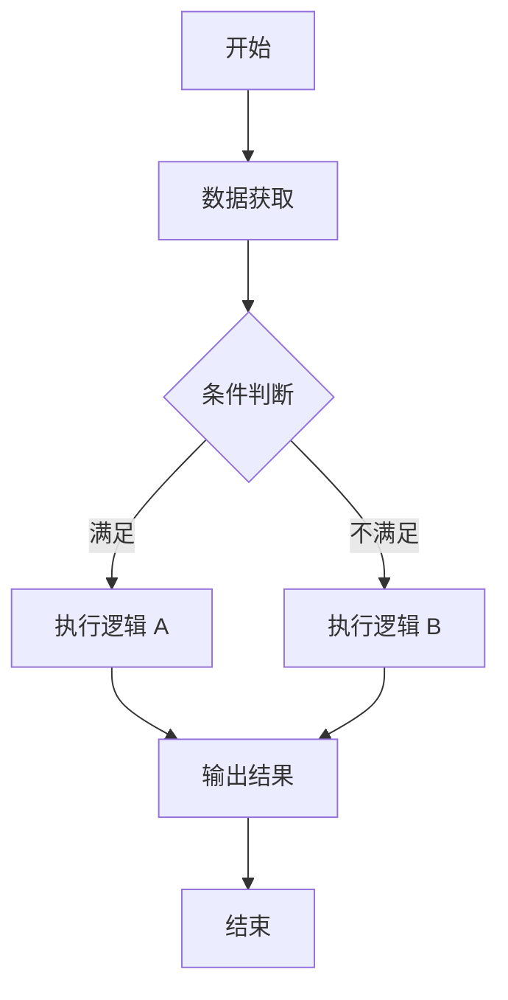

# FlowChart Generator Prompt

> 用途：把复杂 DSP 逻辑转换成流程图草稿。分析阶段可用文本 / Mermaid，交付 Word 时生成黑白流程图图片。

## 输入

```text
逻辑说明：
开始条件：
数据获取：
判断条件：
异常分支：
输出结果：
```

## 输出

1. 文本流程图
2. Mermaid `flowchart TD`
3. Word 交付用流程图节点清单
4. 正文段落对应关系

## 规则

- 节点名称短，不堆字段。
- 判断节点必须有 Yes / No 或“满足 / 不满足”路径。
- Word 流程图默认黑白、统一宽度、边框宽度按最长文字行决定。
- 若流程图过长，优先拆为主流程 + 子流程。

## Mermaid 模板



