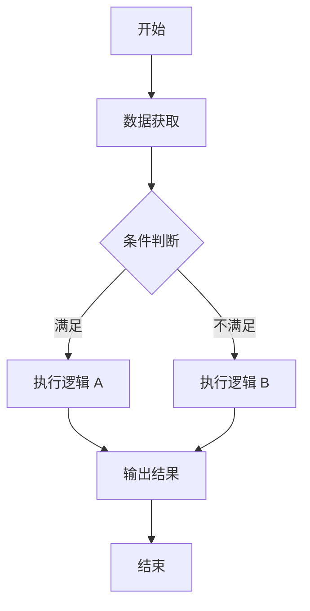

# FlowChart Generator Prompt

> 用途：把复杂 DSP 逻辑转换成可维护的流程图。快速分析可用 Mermaid；正式复杂流程优先生成 Graphviz DOT。
>
> 完整工作流：[[30.areas/dsp-knowledge-base/06_Workflow/Codex_Graphviz_Flowchart_Workflow.md]]

## 输入

```text
逻辑说明：
开始条件：
数据获取：
判断条件：
异常分支：
输出结果：
```

## 输出

1. 文本流程图
2. Mermaid `flowchart TD`
3. Graphviz `.dot`
4. SVG 和 PDF 渲染文件
5. Word 交付用流程图节点清单
6. 正文段落对应关系

## 规则

- 节点名称短，不堆字段。
- 判断节点统一使用“是 / 否”路径。
- Word 流程图默认黑白、统一宽度、边框宽度按最长文字行决定。
- 若流程图过长，优先拆为主流程 + 子流程。
- DOT 使用 `rankdir=TB` 和 `splines=ortho`。
- `.dot` 是源文件，`.svg` 是主要交付文件。

## Mermaid 模板


